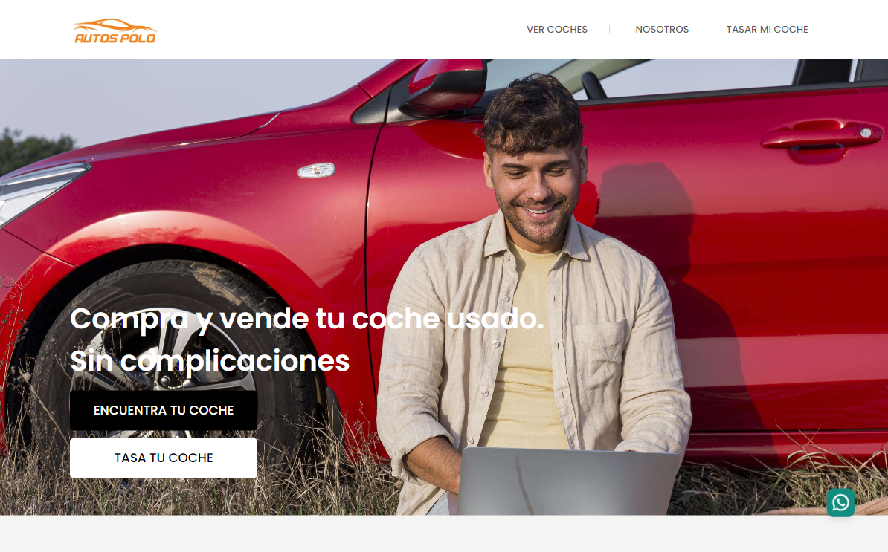

# Autos Polo

**Descripción del proyecto:** Plataforma web para *Autos Polo*, una empresa de compra-venta de autos en España. La aplicación permite a los usuarios explorar vehículos disponibles. El sistema está diseñado para ser autogestionado, con un completo CRUD que permite la administración de los vehículos y detalles desde la plataforma.

**Mi rol en el proyecto:** Desarrolladora Fullstack, encargada de construir tanto el frontend como el backend de la plataforma. Implementé un sistema de gestión autoadministrable con **Firebase**, facilitando las funciones de CRUD para que el equipo de *Autos Polo* pueda actualizar la información de los autos de forma sencilla y rápida. Usé **React.js** en el frontend para crear una interfaz interactiva y optimizada.

<h3>👉🏻 <b>Deploy: <a href="https://autospolo.com" target="_blank">Autos Polo</a></b></h3>

---

## Tecnologías utilizadas:
- 
- 
- 
- 
- 
- 

